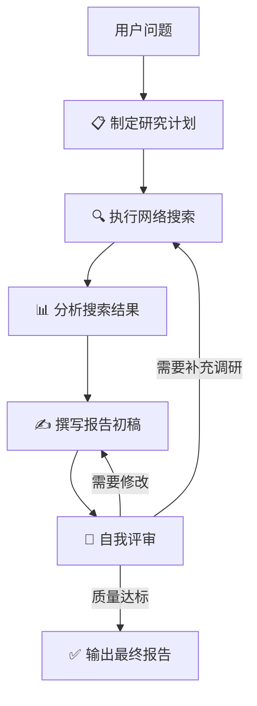

# My First Agent 🚀

我的第一个 AI Agent 项目 —— 一个简单但可扩展的智能体框架。

## 快速开始

```bash
pip install -r requirements.txt
python main.py
```

## 项目结构

```
my_first_agent/
├── main.py              # 入口点
├── my_first_agent/
│   ├── __init__.py
│   ├── agent.py         # Agent 核心逻辑
│   └── tools.py         # 工具定义
├── requirements.txt
└── README.md
```

## 功能

- 基于 ReAct 模式的 Agent 循环
- 可扩展的工具系统
- 对话历史管理

## 许可证

MIT
# Deep Research Agent 🧠

基于 **LangGraph** + **DeepSeek** + **DuckDuckGo** 的自我反思式深度研究助手。

## 特色

- 🔄 **自我反思循环** — Agent 对自己的输出进行批判性评审并迭代改进
- 📋 **研究规划** — 自动将复杂问题分解为可执行的子问题
- 🔍 **实时搜索** — 通过 DuckDuckGo 获取最新信息
- 📊 **结构化报告** — 输出带引用和评级的 Markdown 报告
- 🔁 **循环图架构** — 利用 LangGraph 实现条件路由和循环

## 架构



## 快速开始

### 1. 配置

```bash
cp .env.example .env
# 编辑 .env 填入你的 DeepSeek API Key
```

### 2. 安装依赖

```bash
pip install -r requirements.txt
```

### 3. 运行

```bash
# 交互模式
python main.py

# 单次查询
python main.py "什么是量子计算？与传统计算相比有哪些优势？"
```

### 示例

```
🧠 研究问题 > 2025年AI Agent领域最重要的技术趋势是什么？

📋 制定研究计划...
🔍 执行网络搜索...
📊 分析搜索结果...
✍️ 撰写报告初稿...
🧐 自我评审中...
     完整性: 8/10 · 准确性: 7/10 · 结构性: 9/10 · 客观性: 8/10
```

## 项目结构

```
my_first_agent/
├── main.py                    # CLI 入口
├── src/
│   └── my_first_agent/
│       ├── config.py          # Pydantic Settings 配置
│       ├── graph/
│       │   ├── state.py       # LangGraph 状态定义
│       │   ├── nodes.py       # 各阶段节点逻辑
│       │   └── graph.py       # 图构建与编译
│       ├── tools/
│       │   ├── search.py      # DuckDuckGo 搜索
│       │   └── fetch.py       # 网页内容抓取
│       ├── prompts/
│       │   └── prompts.py     # 提示词模板
│       └── utils/
│           └── formatting.py  # 格式化工具
├── .env.example
├── requirements.txt
└── README.md
```

## 使用的技术

| 技术 | 用途 |
|------|------|
| **LangGraph** | 有向图状态机，管理 Agent 工作流 |
| **LangChain** | LLM 调用链、Prompt 模板 |
| **DeepSeek API** | 底层 LLM（OpenAI 兼容接口） |
| **DuckDuckGo** | 免费网络搜索（无需 API Key） |
| **Rich** | 终端 UI 美化 |

## 许可证

MIT
